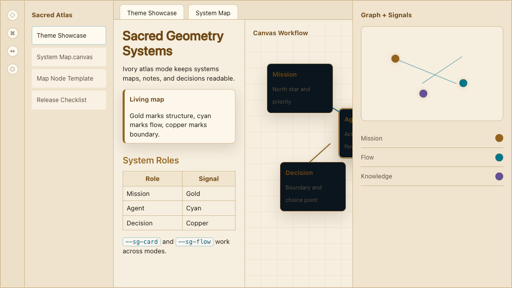

# Sacred Geometry Systems Theme for Obsidian



**Sacred Geometry Systems** is a dark and light Obsidian theme for complex knowledge maps, Canvas systems, and agent ecosystems. It turns the language of sacred geometry into a practical interface grammar: intersections, origins, ecosystems, architecture, progression, and feedback loops.

This repo contains the theme, a maintainable brand book, Canvas starter material, a map-node template, and semantic Canvas snippets.

## What This Theme Solves

Large Obsidian vaults and Canvas maps can become visually flat: everything has the same weight, flow is hard to trace, and the center of a system disappears. Sacred Geometry Systems gives complex work a darker, luminous structure with clear focus states, readable cards, meaningful edge colors, and repeatable map roles.

The focus is functional, not mystical. Geometry is used as a way to reveal hidden structure and help humans move between overview and detail.

## About the Creator

Sacred Geometry Systems is created by **Stanislav Ivanov** as part of the Livastar Observer ecosystem. The theme is designed for people who use Obsidian to map systems, projects, agent workflows, decisions, and knowledge structures with more visual clarity.

Useful links:

- [Tripmindful](https://tripmindful.nl/) - a related mindful preparation project.
- [Livastar Observer](https://livastar.observer) - the wider research and product studio behind this work.
- [LinkedIn](https://www.linkedin.com/in/ivanostanis) - connect with Stanislav Ivanov.
- [Buy Me a Coffee](https://buymeacoffee.com/livastar) - support ongoing theme, template, and systems-mapping work.

## Brand System

The source of truth lives in [BRAND_BOOK.md](BRAND_BOOK.md). It defines:

- Core intention and tone.
- Sacred geometry language.
- Visual palette and typography.
- Obsidian Canvas usage.
- Live-map animation principles.
- Template library.
- The future SacraMap plugin concept.

## Features

- **Dual dark/light palettes** with obsidian or ivory surfaces, gold structure, copper boundaries, deep indigo panels, and signal-cyan flow.
- **Canvas-first styling** for luminous cards, focused nodes, active links, and semantic map roles.
- **Geometry helpers** for rings, flower-of-life fields, spirals, circles, live-flow cues, and framed system panels.
- **Graph and callout styling** aligned with the same semantic colors.
- **Accessible motion behavior** through `prefers-reduced-motion`.
- **Starter artifacts** under `canvas/`, `templates/`, and `snippets/`.

## Installation

### Marketplace

1. In Obsidian, open **Settings > Appearance**.
2. Select **Manage** next to Themes.
3. Search for **Sacred Geometry Systems**.
4. Install and select the theme.

### Manual Install

1. Download the latest release from GitHub.
2. Copy `manifest.json`, `theme.css`, and `versions.json` into:

   ```text
   <vault>/.obsidian/themes/Sacred Geometry Systems/
   ```

3. Restart Obsidian.
4. Open **Settings > Appearance** and select **Sacred Geometry Systems**.

Optional: copy the starter Canvas and template into a working vault and enable `snippets/SG Canvas Cards.css` under **Settings > Appearance > CSS snippets**.

## Working With Canvas

Use the starter Canvas as a model for systems maps:

- Mission / north star.
- Core system.
- Agents.
- Resources.
- Interactions.
- Knowledge clusters.
- Decisions and outcomes.
- Flow tracing and decision paths.

Use `templates/map-node.md` for reusable note-backed nodes. Use semantic classes such as `.node-mission`, `.node-core-system`, `.node-agent`, `.node-resource`, `.node-interaction`, `.node-knowledge`, `.node-decision`, and `.node-outcome` to give cards role-based styling. Older aliases such as `.node-system`, `.node-flow`, and `.node-focus` remain supported.

## Customization

The main brand tokens live in `styles/tokens.css`. Stable public tokens include:

```css
:root {
  --sg-obsidian: #03080d;
  --sg-ivory: #f5ead6;
  --sg-gold: #d8a84f;
  --sg-copper: #b87345;
  --sg-deep-indigo: #12122d;
  --sg-signal-cyan: #16c7e8;
  --sg-role-mission: var(--sg-gold-bright);
  --sg-role-agent: var(--sg-signal-cyan);
  --sg-role-decision: var(--sg-copper);
}
```

Backward-compatible aliases from the original DS-Light theme remain available so older snippets keep rendering.

## Style Settings

Sacred Geometry Systems includes optional Style Settings controls for users who want to tune the theme without writing custom CSS.

Current controls include:

- Structure gold.
- Signal cyan.
- Boundary copper.
- Orbit violet.
- Reduced glow intensity.
- Disabled geometry texture.
- Stronger focus boundaries.

These controls are designed to preserve the theme's symbolic language while making the vault more comfortable for long writing sessions, dense Canvas maps, and everyday knowledge work.

## Accessibility

The theme keeps body text high contrast on dark and light surfaces, uses state color with borders instead of color alone where practical, and disables decorative motion when the user requests reduced motion.

## Compatibility

- Theme version: `0.4.1`
- Minimum Obsidian version: `1.5.0`
- Modes: dark and light
- Obsidian Publish: not currently advertised

## Contributing

Use [CONTRIBUTING.md](CONTRIBUTING.md) for issue quality, design principles, local checks, and scope boundaries. Visual bugs should include Obsidian version, theme version, platform, base color scheme, enabled snippets/plugins, reproduction steps, and a sanitized screenshot.

## Roadmap

Sacred Geometry Systems will keep evolving as a practical visual language for complex thinking in Obsidian.

- **Atlas Controls** - tune glow, flow, and geometry presence for your own thinking style.
- **Living Map Templates** - start from guided Canvas patterns for projects, agents, decisions, knowledge, and feedback loops.
- **Semantic Note Language** - bring the same mission, decision, knowledge, and outcome cues from Canvas into everyday notes.
- **Constellation Graph** - make vault relationships feel more readable, intentional, and alive.
- **Sacred Atlas Demo Vault** - explore a working example vault built around systems mapping, project clarity, and knowledge evolution.

Future work will stay grounded in the same principle: geometry should reveal structure before it decorates.

## License

This project is licensed under the MIT License; see `LICENSE` for details.
